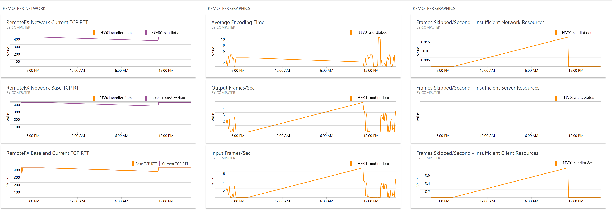

# Log Analytics WVD Query Examples

These are some example queries based on the WVD API logs as they existed last year during private preview.

The logs were collected via a custom powershell script that queries the WVD API on a schedule. At the time the logs could not be natively ingested into Log Analytics.

There are several areas, WVD specific logs, RemoteFX Performance counters and General Performance counters

## Remote FX Counters
To use the RemoteFX dashboard the below counters need to be added to Log Analytics perf counters. You can use PerfMon to find the exact name of any counter you want to add and add it. (https://www.systemcenterautomation.com/2018/11/custom-performance-counters-log-analytics/)

RemoteFX Graphics - Frames Skipped/Second - Insufficient Network Resources

RemoteFX Graphics - Frames Skipped/Second - Insufficient Server Resources

RemoteFX Graphics - Frames Skipped/Second - Insufficient Client Resources

RemoteFX Graphics - Source Frames/Second

RemoteFX Graphics - Frame Quality

RemoteFX Graphics - Graphics Compression ratio

Example RemoteFX Dashboard

Other example queries include Time usage per session, sessions ending in error with error message, open apps and desktops by hostpool, count of sessions by hostpool and more. The queries are in the dashboards folder